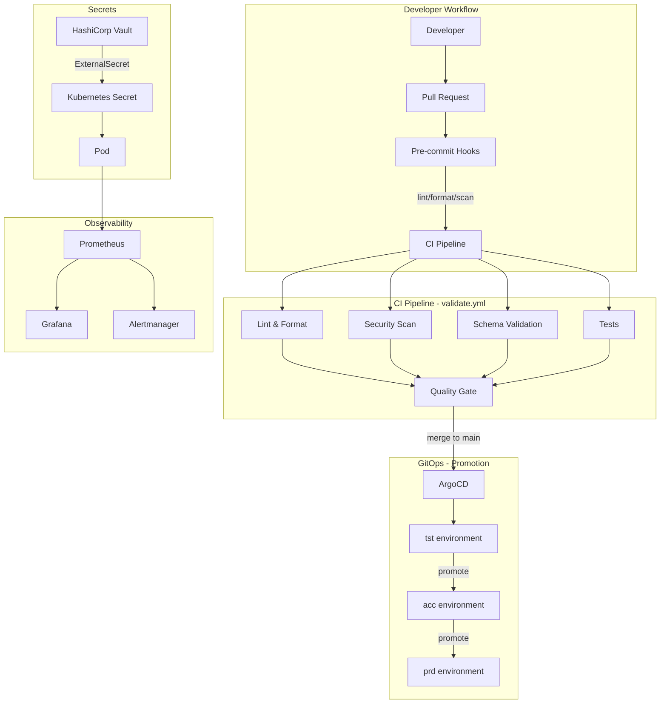

# Platform Engineering Standards

> Enterprise standards, templates, governance, and best practices for Platform Engineering teams.

[](https://github.com/dennis3d19/platform-engineering-standards/actions/workflows/validate.yml)
[](LICENSE)
[](https://github.com/pre-commit/pre-commit)

---

## Background

This repository is a clean-room implementation built to demonstrate technologies, patterns, architecture, and automation used in professional environments.

The original work was performed for employers and clients and cannot be published due to confidentiality and intellectual property restrictions.

No client code, client data, internal documentation, or proprietary configurations are included.

All examples, templates, and standards documented here are generic, technology-appropriate, and safe for public publication.

---

## What This Demonstrates

This repository demonstrates the following professional Platform Engineering skills:

| Skill Area | Details |
|---|---|
| **Infrastructure as Code** | Terraform module structure, standards, validation, and best practices |
| **Container Orchestration** | Kubernetes manifests, security contexts, resource management, and RBAC |
| **Helm Charting** | Chart structure, values management, environment splitting, and linting |
| **Secrets Management** | Vault integration patterns, ExternalSecrets, rotation procedures |
| **GitOps** | ArgoCD application patterns, sync policies, syncWave ordering |
| **CI/CD Design** | GitHub Actions workflows, pipeline gates, artifact generation |
| **Security Engineering** | RBAC, network policies, supply-chain controls, secret scanning |
| **Observability** | Prometheus metrics, alerting rules, Grafana dashboards as code, structured logging |
| **Developer Experience** | Pre-commit hooks, editor config, Makefile targets, onboarding guides |
| **Documentation** | ADR templates, runbooks, production readiness checklists |
| **Governance** | Naming conventions, repository standards, CODEOWNERS, PR templates |
| **Technical Writing** | Mermaid architecture diagrams, design decisions, trade-offs, failure scenarios |

---

## Repository Structure

```text
platform-engineering-standards/
├── .github/
│   ├── ISSUE_TEMPLATE/
│   │   ├── bug_report.md
│   │   ├── feature_request.md
│   │   └── incident.md
│   ├── PULL_REQUEST_TEMPLATE.md
│   └── workflows/
│       └── validate.yml
├── docs/
│   ├── adr/                          # Architecture Decision Records
│   │   ├── README.md
│   │   ├── template.md
│   │   └── 0001-use-terraform-for-iac.md
│   ├── checklists/
│   │   ├── pr-checklist.md
│   │   └── production-readiness-checklist.md
│   ├── onboarding/
│   │   └── platform-onboarding-guide.md
│   ├── runbooks/
│   │   └── incident-response.md
│   └── standards/
│       ├── argocd-standards.md
│       ├── documentation-standards.md
│       ├── engineering-standards.md
│       ├── github-standards.md
│       ├── gitlab-standards.md
│       ├── helm-standards.md
│       ├── kubernetes-standards.md
│       ├── naming-conventions.md
│       ├── observability-standards.md
│       ├── repository-structure-standards.md
│       ├── terraform-standards.md
│       └── vault-standards.md
├── examples/
│   ├── helm/
│   │   └── app-chart/
│   ├── kubernetes/
│   │   └── namespace-setup/
│   └── terraform/
│       └── aws-vpc/
├── tests/
│   ├── README.md
│   └── fixtures/
├── .editorconfig
├── .gitignore
├── .markdownlint.yaml
├── .pre-commit-config.yaml
├── .yamllint.yaml
├── CHANGELOG.md
├── CODEOWNERS
├── CONTRIBUTING.md
├── LICENSE
├── Makefile
└── SECURITY.md
```

---

## Quick Start

### Prerequisites

| Tool | Minimum Version | Install |
|---|---|---|
| `pre-commit` | 3.x | `pip install pre-commit` |
| `yamllint` | 1.x | `pip install yamllint` |
| `markdownlint-cli` | 0.39.x | `npm install -g markdownlint-cli` |
| `shellcheck` | 0.9.x | `apt install shellcheck` |
| `shfmt` | 3.x | `go install mvdan.cc/sh/v3/cmd/shfmt@latest` |
| `detect-secrets` | 1.x | `pip install detect-secrets` |

### Setup

```bash
# Clone the repository
git clone https://github.com/dennis3d19/platform-engineering-standards.git
cd platform-engineering-standards

# Install pre-commit hooks
make install

# Run all validations
make validate

# Run linting only
make lint
```

---

## Standards Index

| Standard | Description | Document |
|---|---|---|
| Engineering Standards | Core engineering rules and conventions | [docs/standards/engineering-standards.md](docs/standards/engineering-standards.md) |
| Naming Conventions | Resource, file, and variable naming rules | [docs/standards/naming-conventions.md](docs/standards/naming-conventions.md) |
| Repository Structure | Repository layout and organisation rules | [docs/standards/repository-structure-standards.md](docs/standards/repository-structure-standards.md) |
| Terraform Standards | IaC module structure and validation rules | [docs/standards/terraform-standards.md](docs/standards/terraform-standards.md) |
| Kubernetes Standards | Manifest security, resource, and RBAC standards | [docs/standards/kubernetes-standards.md](docs/standards/kubernetes-standards.md) |
| Helm Standards | Chart structure, values, and linting standards | [docs/standards/helm-standards.md](docs/standards/helm-standards.md) |
| Vault Standards | Secrets management and rotation standards | [docs/standards/vault-standards.md](docs/standards/vault-standards.md) |
| ArgoCD Standards | GitOps, sync policies, and wave ordering | [docs/standards/argocd-standards.md](docs/standards/argocd-standards.md) |
| Observability Standards | Metrics, alerting, logging, and dashboards | [docs/standards/observability-standards.md](docs/standards/observability-standards.md) |
| GitHub Standards | Repository settings, branch protection, Actions | [docs/standards/github-standards.md](docs/standards/github-standards.md) |
| GitLab Standards | Pipeline structure, SAST, and merge rules | [docs/standards/gitlab-standards.md](docs/standards/gitlab-standards.md) |
| Documentation Standards | Writing style, diagrams, and review rules | [docs/standards/documentation-standards.md](docs/standards/documentation-standards.md) |

---

## Templates and Checklists

| Template | Description | Link |
|---|---|---|
| ADR Template | Architecture Decision Record template | [docs/adr/template.md](docs/adr/template.md) |
| PR Checklist | Pre-merge pull request checklist | [docs/checklists/pr-checklist.md](docs/checklists/pr-checklist.md) |
| Production Readiness | Production readiness review checklist | [docs/checklists/production-readiness-checklist.md](docs/checklists/production-readiness-checklist.md) |
| Incident Response | Incident response runbook template | [docs/runbooks/incident-response.md](docs/runbooks/incident-response.md) |
| Platform Onboarding | New engineer onboarding guide | [docs/onboarding/platform-onboarding-guide.md](docs/onboarding/platform-onboarding-guide.md) |

---

## Architecture Overview



---

## Contributing

See [CONTRIBUTING.md](CONTRIBUTING.md) for contribution guidelines.

## Security

See [SECURITY.md](SECURITY.md) for security policy and vulnerability reporting.

## License

This project is licensed under the Apache License 2.0 — see the [LICENSE](LICENSE) file for details.

## Changelog

See [CHANGELOG.md](CHANGELOG.md) for version history.
