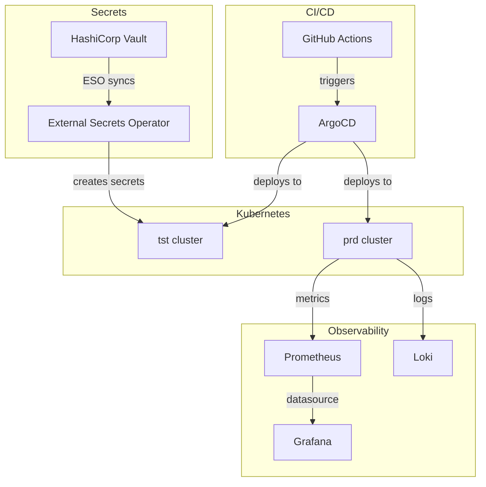

# Platform Onboarding Guide

Welcome to the Platform Engineering team. This guide will walk you through setting up your local environment,
getting access to systems, and understanding how the platform works.

---

## Day 1: Access and Setup

### 1.1 Required Access

Work with your manager to get access to the following systems:

| System | Access Type | Requested From |
|---|---|---|
| GitHub Organisation | Member | Engineering Manager |
| AWS Console | IAM role via SSO | Platform Lead |
| Kubernetes clusters (tst/acc/prd) | kubectl access via SSO | Platform Lead |
| Vault | Policy per team | Platform Lead |
| Grafana | Viewer → Editor | Self-serve after login |
| Alertmanager | View only | Automatic |
| Slack: `#platform-engineering` | Member | Manager adds you |
| Slack: `#incidents` | Member | Manager adds you |

### 1.2 Local Development Tools

Install all required tools:

```bash
# macOS with Homebrew
brew install \
  git \
  kubectl \
  helm \
  terraform \
  vault \
  pre-commit \
  yamllint \
  shellcheck \
  shfmt \
  detect-secrets \
  kubeconform \
  argocd

# Node.js tools
npm install -g markdownlint-cli

# Python tools
pip3 install detect-secrets pytest

# Verify installations
kubectl version --client
helm version
terraform version
pre-commit --version
```

### 1.3 Clone Repositories

```bash
# Platform engineering standards (this repo)
git clone https://github.com/example/platform-engineering-standards.git
cd platform-engineering-standards

# Platform infrastructure (if applicable)
git clone https://github.com/example/platform-infrastructure.git
```

### 1.4 Configure kubectl

```bash
# Get cluster credentials (example for AWS EKS)
aws eks update-kubeconfig \
  --name tst-platform-cluster \
  --region eu-west-1 \
  --alias tst

# Verify access
kubectl get nodes
kubectl get namespaces
```

---

## Day 1-5: Understanding the Platform

### 2.1 Repository Structure

Read the [Repository Structure Standards](../standards/repository-structure-standards.md) to understand
how code is organised across the platform.

### 2.2 Standards Documents

Read these standards in order:

1. [Engineering Standards](../standards/engineering-standards.md)
2. [Naming Conventions](../standards/naming-conventions.md)
3. [Kubernetes Standards](../standards/kubernetes-standards.md)
4. [Terraform Standards](../standards/terraform-standards.md)
5. [Observability Standards](../standards/observability-standards.md)

### 2.3 Platform Architecture

The platform consists of these major components:



### 2.4 Environments

| Environment | Purpose | Sync Policy | Who Can Deploy |
|---|---|---|---|
| `tst` | Development and testing | Automated | All engineers |
| `acc` | Acceptance testing and staging | Automated | All engineers |
| `prd` | Production | Manual approval | Platform leads |

---

## Week 1: First Contribution

### 3.1 Review the Standards Repository

```bash
cd platform-engineering-standards
ls docs/standards
```

### 3.2 Make Your First PR

A good first PR is a documentation improvement or fixing a typo.

1. Create a branch: `git checkout -b docs/update-onboarding-guide`
2. Make your change.
3. Review the updated markdown for accuracy and broken links.
4. Commit with Conventional Commits: `git commit -m "docs(onboarding): add tool version requirements"`
5. Open a PR.

### 3.3 Review Process

- Assign yourself as the PR author.
- Request review from a team member familiar with the affected standards.
- Address all review comments before merging.
- Ensure the repository documentation stays internally consistent before requesting a final review.

---

## Reference: Key Commands

### Kubernetes

```bash
# List all pods in a namespace
kubectl get pods -n platform-tst

# Get logs
kubectl logs deployment/my-app -n platform-tst --tail=50

# Describe a pod
kubectl describe pod <pod-name> -n platform-tst

# Port forward to a service
kubectl port-forward svc/grafana 3000:80 -n monitoring-prd

# Apply a manifest
kubectl apply -f manifest.yaml

# Dry run
kubectl apply -f manifest.yaml --dry-run=server
```

### Helm

```bash
# List installed releases
helm list -n platform-tst

# Install or upgrade
helm upgrade --install my-app ./charts/my-app \
  -f charts/my-app/values-tst.yaml \
  -n platform-tst

# Diff (with helm-diff plugin)
helm diff upgrade my-app ./charts/my-app \
  -f charts/my-app/values-tst.yaml

# Rollback
helm rollback my-app 1 -n platform-tst
```

### Terraform

```bash
# Format
terraform fmt -recursive

# Validate
terraform validate

# Plan
terraform plan -var-file=tst.tfvars -out=tst.tfplan

# Apply (from plan)
terraform apply tst.tfplan

# Show state
terraform state list
terraform state show <resource>
```

### ArgoCD

```bash
# Login
argocd login argocd.example.com --sso

# List applications
argocd app list

# Sync an application
argocd app sync my-application-tst

# Get application status
argocd app get my-application-tst

# Rollback
argocd app rollback my-application-tst <revision>
```

---

## Getting Help

| Need | Contact |
|---|---|
| Access issues | Platform Lead via Slack |
| Technical questions | `#platform-engineering` Slack channel |
| Incidents | `#incidents` Slack channel |
| Security concerns | Security team (private channel) |
| Documentation errors | Open a GitHub issue |

---

## Useful Links

- [Engineering Standards](../standards/engineering-standards.md)
- [Production Readiness Checklist](../checklists/production-readiness-checklist.md)
- [Incident Response Runbook](../runbooks/incident-response.md)
- [ADR Index](../adr/README.md)
