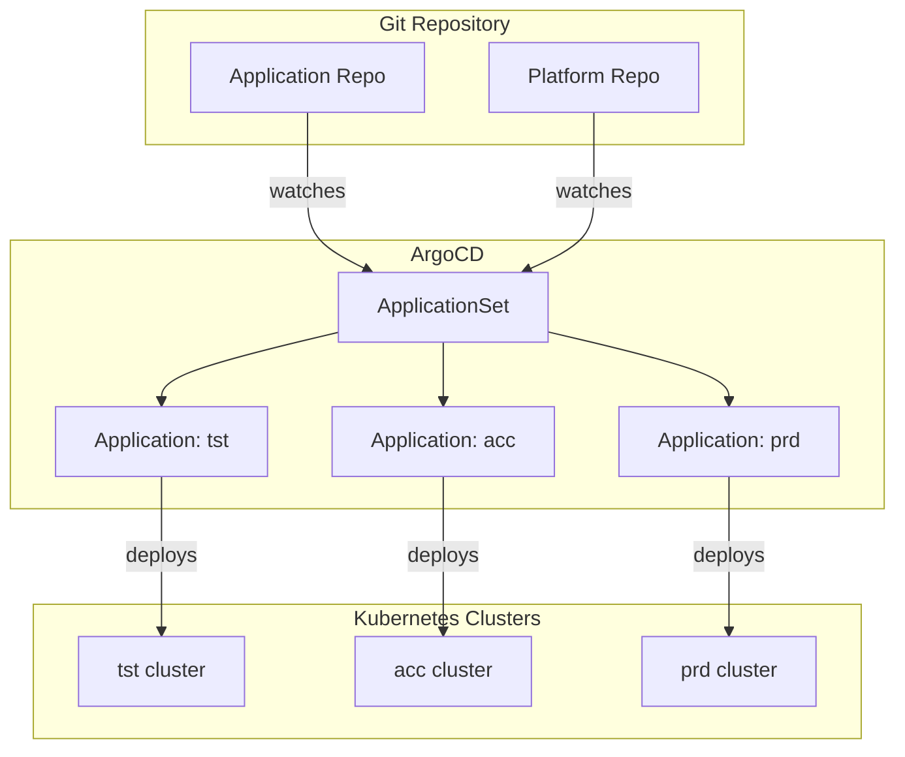

# ArgoCD Standards

Standards for GitOps, ArgoCD application management, and deployment patterns across the platform.

---

## Architecture Overview



---

## Application Definition

### Standard Application

```yaml
apiVersion: argoproj.io/v1alpha1
kind: Application
metadata:
  name: my-application-tst
  namespace: argocd
  annotations:
    argocd.argoproj.io/sync-wave: "10"
  labels:
    app: my-application
    environment: tst
    team: platform
spec:
  project: platform-tst
  source:
    repoURL: https://github.com/example/platform-apps
    targetRevision: main
    path: apps/my-application/overlays/tst
  destination:
    server: https://kubernetes.default.svc
    namespace: my-app-tst
  syncPolicy:
    automated:
      prune: true
      selfHeal: true
      allowEmpty: false
    syncOptions:
      - CreateNamespace=true
      - PrunePropagationPolicy=foreground
      - PruneLast=true
    retry:
      limit: 5
      backoff:
        duration: 5s
        factor: 2
        maxDuration: 3m
  ignoreDifferences:
    - group: apps
      kind: Deployment
      jsonPointers:
        - /spec/replicas
```

---

## Sync Policies

Sync policies must be explicitly set for each environment. Do not rely on defaults.

| Environment | `automated` | `selfHeal` | `prune` | Rationale |
|---|---|---|---|---|
| `tst` | Yes | Yes | Yes | Fully automated for fast feedback |
| `acc` | Yes | Yes | Yes | Automated with extra testing gates |
| `prd` | No | Yes | No | Manual sync required; selfHeal for drift |

### Production Sync

In production, disable automated sync to require explicit human approval:

```yaml
syncPolicy:
  # No 'automated' block in production
  syncOptions:
    - PrunePropagationPolicy=foreground
  retry:
    limit: 3
    backoff:
      duration: 10s
      factor: 2
      maxDuration: 5m
```

Trigger production syncs via:

1. ArgoCD CLI: `argocd app sync my-application-prd`
2. ArgoCD UI: manual sync button with confirmation
3. CI/CD pipeline after approval gate

---

## Sync Waves

Use `syncWave` annotations to enforce deployment ordering across dependent applications.

```yaml
# Wave 0: Namespaces and CRDs
metadata:
  annotations:
    argocd.argoproj.io/sync-wave: "0"

# Wave 1: Infrastructure (Vault, cert-manager)
metadata:
  annotations:
    argocd.argoproj.io/sync-wave: "1"

# Wave 2: Platform services (Prometheus, Grafana)
metadata:
  annotations:
    argocd.argoproj.io/sync-wave: "2"

# Wave 10: Applications
metadata:
  annotations:
    argocd.argoproj.io/sync-wave: "10"

# Wave 20: Ingress and load balancers
metadata:
  annotations:
    argocd.argoproj.io/sync-wave: "20"
```

### Standard Wave Assignments

| Wave | Resources |
|---|---|
| 0 | Namespaces, CRDs, ClusterRoles |
| 1 | cert-manager, external-secrets, vault-agent |
| 2 | Prometheus, Grafana, Alertmanager |
| 5 | Platform APIs and services |
| 10 | Application workloads |
| 20 | Ingress controllers, external DNS |

---

## ApplicationSet

Use ApplicationSets for multi-environment or multi-cluster deployments:

```yaml
apiVersion: argoproj.io/v1alpha1
kind: ApplicationSet
metadata:
  name: my-application
  namespace: argocd
spec:
  generators:
    - list:
        elements:
          - environment: tst
            cluster: https://tst-cluster.example.com
            namespace: my-app-tst
          - environment: acc
            cluster: https://acc-cluster.example.com
            namespace: my-app-acc
          - environment: prd
            cluster: https://prd-cluster.example.com
            namespace: my-app-prd
  template:
    metadata:
      name: "my-application-{{environment}}"
      annotations:
        argocd.argoproj.io/sync-wave: "10"
    spec:
      project: "platform-{{environment}}"
      source:
        repoURL: https://github.com/example/platform-apps
        targetRevision: main
        path: "apps/my-application/overlays/{{environment}}"
      destination:
        server: "{{cluster}}"
        namespace: "{{namespace}}"
```

---

## Projects

Each team or environment should use an AppProject to enforce access control and source/destination restrictions:

```yaml
apiVersion: argoproj.io/v1alpha1
kind: AppProject
metadata:
  name: platform-prd
  namespace: argocd
spec:
  description: Platform Engineering production applications
  sourceRepos:
    - https://github.com/example/platform-apps
    - https://github.com/example/platform-charts
  destinations:
    - namespace: "platform-*"
      server: https://prd-cluster.example.com
    - namespace: "monitoring-prd"
      server: https://prd-cluster.example.com
  clusterResourceWhitelist:
    - group: ""
      kind: Namespace
  namespaceResourceBlacklist:
    - group: ""
      kind: ResourceQuota
  roles:
    - name: platform-deployer
      description: Ability to sync platform applications
      policies:
        - p, proj:platform-prd:platform-deployer, applications, sync, platform-prd/*, allow
      groups:
        - platform-team
```

---

## Security

- ArgoCD must authenticate via SSO (OIDC) — disable local user login in production.
- RBAC in ArgoCD must follow least-privilege per team and environment.
- Repository access uses SSH keys or GitHub Apps — never personal access tokens.
- Sensitive values in ApplicationSets must use secrets, not plain text.
- Enable ArgoCD's audit log for all sync and access events.

---

## Failure Scenarios

| Scenario | Detection | Response |
|---|---|---|
| Drift detected | ArgoCD health check | selfHeal re-applies manifests |
| Sync fails | ArgoCD alert | Review error, fix source, retry |
| CRD missing | Sync wave failure | Apply CRD in wave 0 first |
| Image pull failure | Pod event | Update image tag, trigger sync |
| Rollback needed | Manual review | Revert commit, sync previous wave |

---

## Production Considerations

- Never enable automated prune in production — require manual review.
- Set retry limits and backoff to prevent rapid-loop syncs.
- Use `ignoreDifferences` for fields managed by controllers (e.g., HPA `replicas`).
- Configure resource health checks for custom resources.
- Separate ArgoCD instances for production and non-production where isolation is required.
