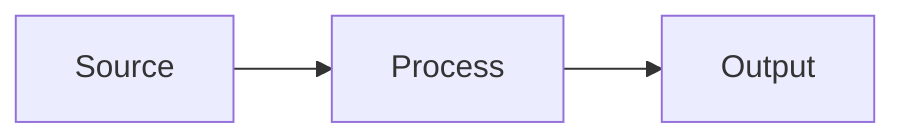

# Documentation Standards

Standards for technical documentation across the platform.

---

## Principles

1. **Documentation lives with the code** — do not maintain a separate wiki as the single source of truth.
2. **Document why, not what** — code is self-descriptive; docs explain intent, constraints, and trade-offs.
3. **Keep documentation current** — update docs in the same PR as the code change.
4. **Write for your audience** — separate operator docs from developer docs from security docs.
5. **Prefer examples over prose** — show how something works before explaining why.

---

## Required Documentation

### Every Repository

```
README.md               # Purpose, structure, quick start
CONTRIBUTING.md         # Contribution guidelines
CHANGELOG.md            # Version history
SECURITY.md             # Security policy and reporting
LICENSE                 # License terms
```

### Every Module, Chart, or Component

```
README.md               # Purpose, inputs, outputs, examples
```

Minimum README sections:

1. **Overview** — what it does and what it does not do
2. **Prerequisites** — required tools and access
3. **Quick Start** — minimal working example
4. **Configuration** — inputs and options
5. **Outputs** — what the module produces
6. **Operational Notes** — limits, known behaviours, warnings
7. **Links** — references to deeper documentation

---

## Markdown Standards

### Headings

Use ATX-style headings (`#`). Do not use Setext-style (`===` or `---`):

```markdown
# Level 1 (document title — one per file)
## Level 2 (major sections)
### Level 3 (subsections)
#### Level 4 (use sparingly)
```

### Lists

Use `-` for unordered lists. Use `1.` `2.` `3.` for ordered lists:

```markdown
- Item one
- Item two
  - Nested item

1. First step
2. Second step
3. Third step
```

### Code Blocks

Always specify the language for syntax highlighting:

````markdown
```bash
helm upgrade --install my-app ./charts/my-app -f values-prd.yaml
```

```yaml
apiVersion: v1
kind: ConfigMap
```

```hcl
variable "environment" {
  type = string
}
```
````

### Tables

Use tables for structured comparisons and reference data:

```markdown
| Column 1 | Column 2 | Column 3 |
|---|---|---|
| Value 1  | Value 2  | Value 3  |
```

### Links

Use relative links for files in the same repository:

```markdown
See [naming conventions](../standards/naming-conventions.md) for details.
```

Use absolute URLs for external references:

```markdown
See [Keep a Changelog](https://keepachangelog.com/) for the format.
```

---

## Mermaid Diagrams

Include Mermaid diagrams for:

- Architecture overviews
- Data flow diagrams
- Sequence diagrams for complex interactions
- State machines

````markdown

````

### Diagram Types by Use Case

| Use Case | Diagram Type |
|---|---|
| System architecture | `graph TB` or `graph LR` |
| Request flow | `sequenceDiagram` |
| Deployment pipeline | `graph LR` |
| State transitions | `stateDiagram-v2` |
| Data relationships | `erDiagram` |

---

## Architecture Decision Records (ADRs)

Use ADRs to document significant decisions with context, alternatives, and trade-offs.

See the [ADR template](../adr/template.md) for the required format.

### When to Write an ADR

- Choosing between two or more viable technical approaches
- Accepting a known limitation or trade-off
- Changing a previously established standard
- Introducing a new dependency, tool, or pattern

### ADR Numbering

Use sequential zero-padded numbers: `0001`, `0002`, `0003`.

---

## Changelog Format

Follow [Keep a Changelog](https://keepachangelog.com/en/1.0.0/) format:

```markdown
## [Unreleased]

### Added
- New feature description

### Changed
- Changed behaviour description

### Fixed
- Bug fix description

### Removed
- Removed feature description

### Security
- Security fix description

## [1.2.0] - 2024-03-15

### Added
- ...
```

---

## Runbook Standards

Runbooks are operational procedures for responding to incidents and performing maintenance.

Every runbook must include:

1. **Overview** — what this runbook covers
2. **Symptoms** — what alerts or signals trigger this runbook
3. **Severity** — expected severity level
4. **Steps** — numbered, specific, actionable steps
5. **Escalation** — when and how to escalate
6. **Post-Incident** — actions to take after resolution

---

## Documentation Review Checklist

Before merging documentation changes:

- [ ] No grammatical or spelling errors
- [ ] Code examples are correct and runnable
- [ ] Links are not broken
- [ ] Mermaid diagrams render correctly
- [ ] Sensitive information (real domains, IPs, credentials) is not present
- [ ] `CHANGELOG.md` is updated
- [ ] Markdownlint passes

---

## Anti-patterns

| Anti-pattern | Why | Alternative |
|---|---|---|
| `TODO: document this` | Documentation never gets written | Write it now, or open a ticket |
| Screenshots of code | Not searchable, gets stale | Use code blocks |
| Wiki-only documentation | Diverges from code, gets lost | Keep docs in the repository |
| One massive document | Hard to navigate and maintain | Split by concern and audience |
| Outdated examples | Misleads users | Update in the same PR as the code |
