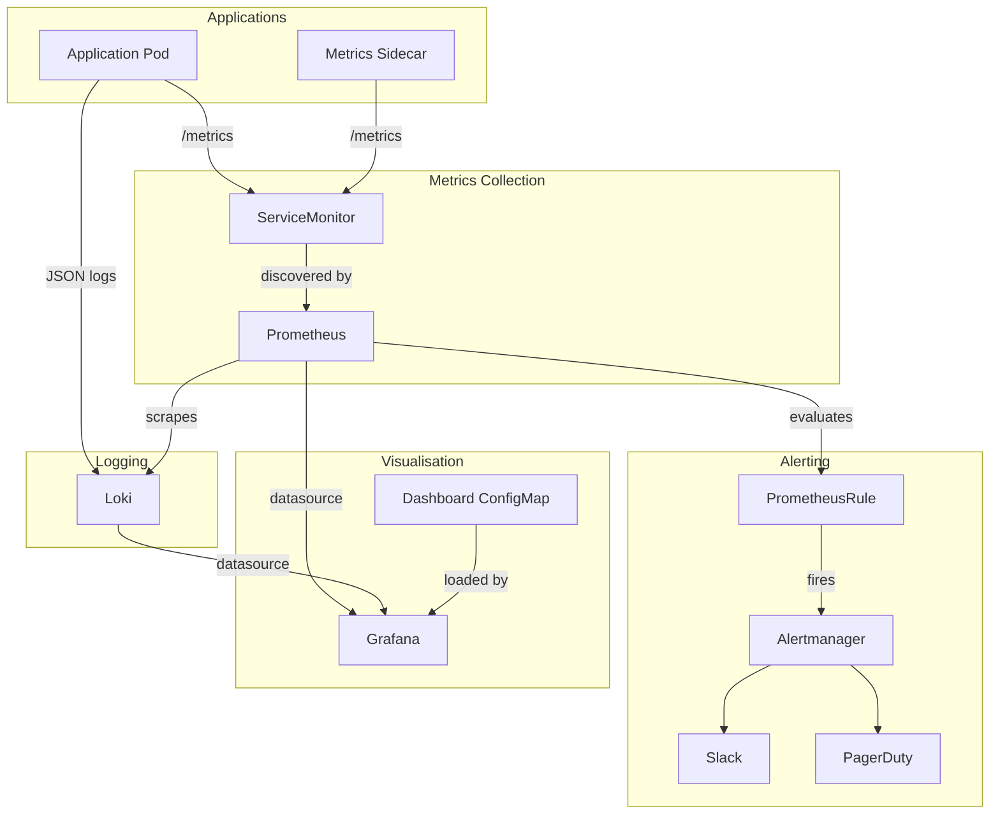

# Observability Standards

Standards for metrics, alerting, logging, and dashboards across the platform.

---

## Architecture Overview



---

## Prometheus Metrics

### Exposing Metrics

All long-running workloads must expose Prometheus metrics via `/metrics`:

```yaml
# Deployment annotation for direct scraping (legacy — prefer ServiceMonitor)
annotations:
  prometheus.io/scrape: "true"
  prometheus.io/port: "9090"
  prometheus.io/path: "/metrics"
```

Prefer ServiceMonitor over annotation-based scraping for kube-prometheus-stack.

### ServiceMonitor

```yaml
apiVersion: monitoring.coreos.com/v1
kind: ServiceMonitor
metadata:
  name: my-application
  namespace: monitoring-tst
  labels:
    # Must match Prometheus instance selector
    monitoring: prometheus
    environment: tst
spec:
  selector:
    matchLabels:
      app: my-application
  namespaceSelector:
    matchNames:
      - my-app-tst
  endpoints:
    - port: metrics
      path: /metrics
      interval: 30s
      scrapeTimeout: 10s
```

### Metric Naming

Follow the [Prometheus naming conventions](https://prometheus.io/docs/practices/naming/):

```
<namespace>_<subsystem>_<name>_<unit>_total
```

Examples:

```
http_requests_total
http_request_duration_seconds
database_connections_active
cache_hits_total
cache_misses_total
```

---

## Alerting

### PrometheusRule

```yaml
apiVersion: monitoring.coreos.com/v1
kind: PrometheusRule
metadata:
  name: my-application-alerts
  namespace: monitoring-tst
  labels:
    monitoring: prometheus
    environment: tst
spec:
  groups:
    - name: my-application.alerts
      interval: 1m
      rules:
        - alert: MyApplicationHighErrorRate
          expr: |
            rate(http_requests_total{job="my-application", status=~"5.."}[5m])
            / rate(http_requests_total{job="my-application"}[5m]) > 0.05
          for: 5m
          labels:
            severity: warning
            team: platform
          annotations:
            summary: "High error rate on {{ $labels.job }}"
            description: >
              {{ $labels.job }} is returning > 5% 5xx errors.
              Current rate: {{ $value | humanizePercentage }}.
            runbook_url: "https://docs.example.com/runbooks/my-application-high-error-rate"

        - alert: MyApplicationDown
          expr: up{job="my-application"} == 0
          for: 2m
          labels:
            severity: critical
            team: platform
          annotations:
            summary: "{{ $labels.job }} is down"
            description: "{{ $labels.instance }} has been unreachable for 2 minutes."
            runbook_url: "https://docs.example.com/runbooks/my-application-down"
```

### Alert Standards

Every alert must include:

| Field | Required | Example |
|---|---|---|
| `severity` | Yes | `critical`, `warning`, `info` |
| `team` | Yes | `platform`, `security` |
| `summary` | Yes | Short one-line description |
| `description` | Yes | Context and current value |
| `runbook_url` | Yes | Link to resolution steps |

### Severity Levels

| Severity | Meaning | Notification |
|---|---|---|
| `critical` | Service down or data loss imminent | Page on-call immediately |
| `warning` | Degraded or threshold approaching | Slack channel notification |
| `info` | Informational, no action required | Dashboard only |

### Alert Design Principles

- Alerts should be actionable — if you cannot act on it, it should not fire.
- Set `for` duration to avoid flapping on transient spikes.
- Use `runbook_url` to link directly to resolution steps.
- Avoid alert noise — tune thresholds from real data, not guesses.
- Use multi-window multi-burn-rate for SLO-based alerting.

---

## Logging

### Structured Logging

All platform components must emit JSON-structured logs:

```json
{
  "timestamp": "2024-01-15T10:30:00.000Z",
  "level": "info",
  "service": "my-application",
  "environment": "prd",
  "trace_id": "abc123def456",
  "message": "Request processed successfully",
  "duration_ms": 45,
  "status_code": 200,
  "path": "/api/v1/users"
}
```

### Log Levels

| Level | When to Use |
|---|---|
| `error` | Unexpected failures requiring attention |
| `warn` | Unexpected but recoverable situations |
| `info` | Normal operational events (startup, shutdown, requests) |
| `debug` | Detailed diagnostic information |

**Rule:** Use `info` in production. Never use `debug` in `prd`. Disable debug logging via configuration, not code.

### Log Sanitisation

- Never log credentials, tokens, passwords, or personal data.
- Redact sensitive fields before logging.
- Use structured field redaction, not regex on log strings.

```go
// Good - structured field with redaction
log.Info("auth request processed",
    "user_id", userID,
    "token", "[REDACTED]",
)

// Bad - token in log string
log.Infof("auth for user %s with token %s succeeded", userID, token)
```

---

## Grafana Dashboards

### Dashboards as Code

All dashboards must be stored in Git and deployed via ConfigMap or GitOps:

```yaml
apiVersion: v1
kind: ConfigMap
metadata:
  name: my-application-dashboard
  namespace: monitoring-tst
  labels:
    grafana_dashboard: "1"
data:
  my-application.json: |
    {
      "title": "My Application",
      "uid": "my-application-v1",
      ...
    }
```

### Dashboard Standards

- Every dashboard must have a `uid` for stable URL linking.
- Include a `$environment` variable to filter by environment.
- Include a `$datasource` variable for multi-cluster support.
- Dashboards must have a description explaining the use case.
- Do not save dashboards only in the Grafana UI — they will be lost on restart.

---

## SLOs and Error Budgets

Define SLOs using the following pattern:

```yaml
# SLO: my-application availability
# Target: 99.9% availability over 30 days

slo:
  name: my-application-availability
  target: 0.999
  window: 30d
  indicator:
    ratio:
      good:
        metric: http_requests_total{job="my-application", status!~"5.."}
      total:
        metric: http_requests_total{job="my-application"}
```

Alert at multiple burn rates to catch both fast burns and slow burns.

---

## Production Considerations

- Retain Prometheus metrics for 15 days in standard configuration; use Thanos or Cortex for long-term storage.
- Deduplicate metrics when running multi-cluster Prometheus with Thanos or Victoria Metrics.
- Set scrape intervals appropriate to workload (`30s` for most, `15s` for latency-critical).
- Configure alerting routes in Alertmanager to avoid notification fatigue.
- Review and prune unused dashboards quarterly.
- Test alert rules fire correctly before deploying to production.
