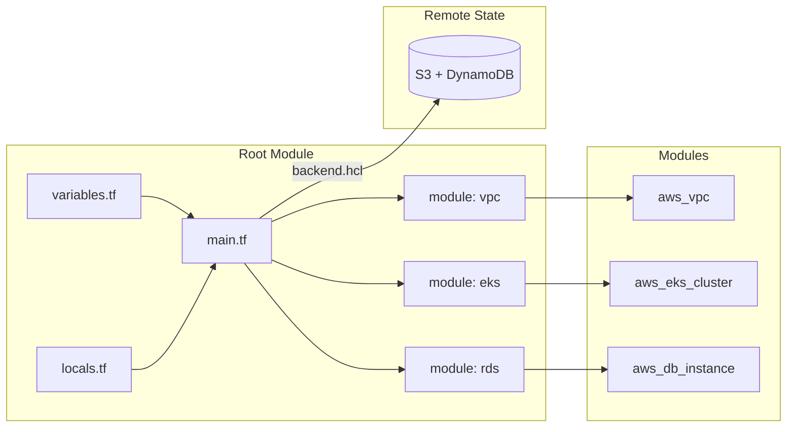

# Terraform Standards

Standards for all Terraform infrastructure-as-code across the platform.

---

## Module Structure

Every Terraform module must follow this directory structure:

```text
my-module/
├── README.md
├── main.tf
├── variables.tf
├── outputs.tf
├── locals.tf
├── versions.tf
└── examples/
    └── basic/
        ├── README.md
        ├── main.tf
        └── terraform.tfvars.example
```

### File Responsibilities

| File | Purpose |
|---|---|
| `main.tf` | Primary resources and module calls |
| `variables.tf` | All input variable declarations |
| `outputs.tf` | All output declarations |
| `locals.tf` | Derived values and computed expressions |
| `versions.tf` | Terraform and provider version constraints |
| `README.md` | Module documentation (inputs, outputs, examples) |

---

## Variables

### Required Fields

Every variable must have `type` and `description`:

```hcl
variable "environment" {
  type        = string
  description = "Deployment environment. One of: tst, acc, prd."

  validation {
    condition     = contains(["tst", "acc", "prd"], var.environment)
    error_message = "environment must be one of: tst, acc, prd."
  }
}
```

### Type Discipline

- Never use `type = any` unless the shape is genuinely unbounded and documented.
- Use object types for structured inputs.
- Use validation blocks for enums, ranges, and patterns.

```hcl
variable "instance_config" {
  type = object({
    instance_type = string
    min_size      = number
    max_size      = number
    enable_spot   = optional(bool, false)
  })
  description = "EC2 Auto Scaling Group configuration."
}
```

### Boolean Naming

Use verb prefixes for boolean variables:

```hcl
variable "enable_monitoring"   { type = bool }
variable "create_vpc"          { type = bool }
variable "allow_public_access" { type = bool }
variable "is_primary"          { type = bool }
```

### Sensitive Variables

Mark sensitive inputs with `sensitive = true`:

```hcl
variable "database_password" {
  type        = string
  description = "Database master password. Sourced from Vault."
  sensitive   = true
}
```

---

## Locals

Group derived values in `locals.tf` using concern-based prefixes:

```hcl
locals {
  # Naming
  naming_prefix = "${var.environment}-${var.application}"
  naming_suffix = var.region

  # Tags applied to all resources
  tags_common = merge(var.tags, {
    Environment = var.environment
    ManagedBy   = "terraform"
    Application = var.application
    Team        = "platform"
  })

  # Network configuration
  network_vpc_cidr    = "10.0.0.0/16"
  network_azs         = slice(data.aws_availability_zones.available.names, 0, 3)
}
```

---

## Outputs

- Sort outputs alphabetically.
- Every output requires a `description`.
- Expose only stable interfaces (IDs, names, ARNs) — not computed expressions.
- Mark sensitive outputs with `sensitive = true`.

```hcl
output "cluster_arn" {
  description = "EKS cluster ARN."
  value       = module.eks.cluster_arn
}

output "cluster_endpoint" {
  description = "Kubernetes API server endpoint."
  value       = module.eks.cluster_endpoint
}

output "vpc_id" {
  description = "VPC identifier."
  value       = aws_vpc.main.id
}
```

---

## Versions

Pin Terraform and all providers to a tested range in `versions.tf`:

```hcl
terraform {
  required_version = ">= 1.9, < 2.0"

  required_providers {
    aws = {
      source  = "hashicorp/aws"
      version = "~> 5.0"
    }
    kubernetes = {
      source  = "hashicorp/kubernetes"
      version = "~> 2.0"
    }
  }
}
```

---

## Backend Configuration

- Never configure a backend inside a module — only in root modules.
- Store backend configuration outside version control.
- Use `backend.hcl` for backend-specific settings.

```hcl
# versions.tf - root module only
terraform {
  backend "s3" {
    # Populated via -backend-config=backend.hcl
  }
}
```

```hcl
# backend.hcl (not committed)
bucket         = "my-terraform-state"
key            = "platform/vpc/terraform.tfstate"
region         = "eu-west-1"
dynamodb_table = "terraform-state-lock"
encrypt        = true
```

---

## Security Standards

### State Security

- All state must be stored in remote backends with encryption at rest.
- State locking must be enabled to prevent concurrent modifications.
- State access must be restricted to the platform team only.

### Provider Authentication

- Never hardcode credentials in Terraform files.
- Use IAM roles for service accounts (IRSA) for EKS workloads.
- Use Workload Identity for GKE workloads.
- Use Managed Identity for AKS workloads.

### Sensitive Resources

```hcl
# Mark sensitive outputs
output "database_connection_string" {
  description = "Database connection string."
  value       = "postgresql://${aws_db_instance.main.username}@${aws_db_instance.main.endpoint}"
  sensitive   = true
}
```

---

## Validation Checklist

Before every pull request:

- [ ] `terraform fmt` — zero changes
- [ ] `terraform validate` — clean
- [ ] `tflint` — zero warnings (with project config)
- [ ] `checkov` — no unacknowledged failures
- [ ] Example `terraform plan` runs without error

---

## Architecture Diagram



---

## Design Decisions

### Why environment-split tfvars?

Using separate `tfvars` files per environment (`tst.tfvars`, `prd.tfvars`) ensures:

- Environment differences are explicit and reviewable.
- Production values are never accidentally applied to test.
- CI/CD pipelines target specific environments deterministically.

### Why constrain provider versions?

Loose provider version constraints (`>= 5.0`) allow accidental upgrades that introduce breaking changes.
Constrained ranges (`~> 5.0`) allow patch updates while preventing unexpected major version jumps.

### Trade-offs

| Decision | Trade-off |
|---|---|
| No `any` types | More verbose declarations, but explicit contracts |
| Alphabetically sorted outputs | Easier to find, minor overhead when adding |
| `backend.hcl` outside VCS | Slightly more complex init, but credentials never committed |
