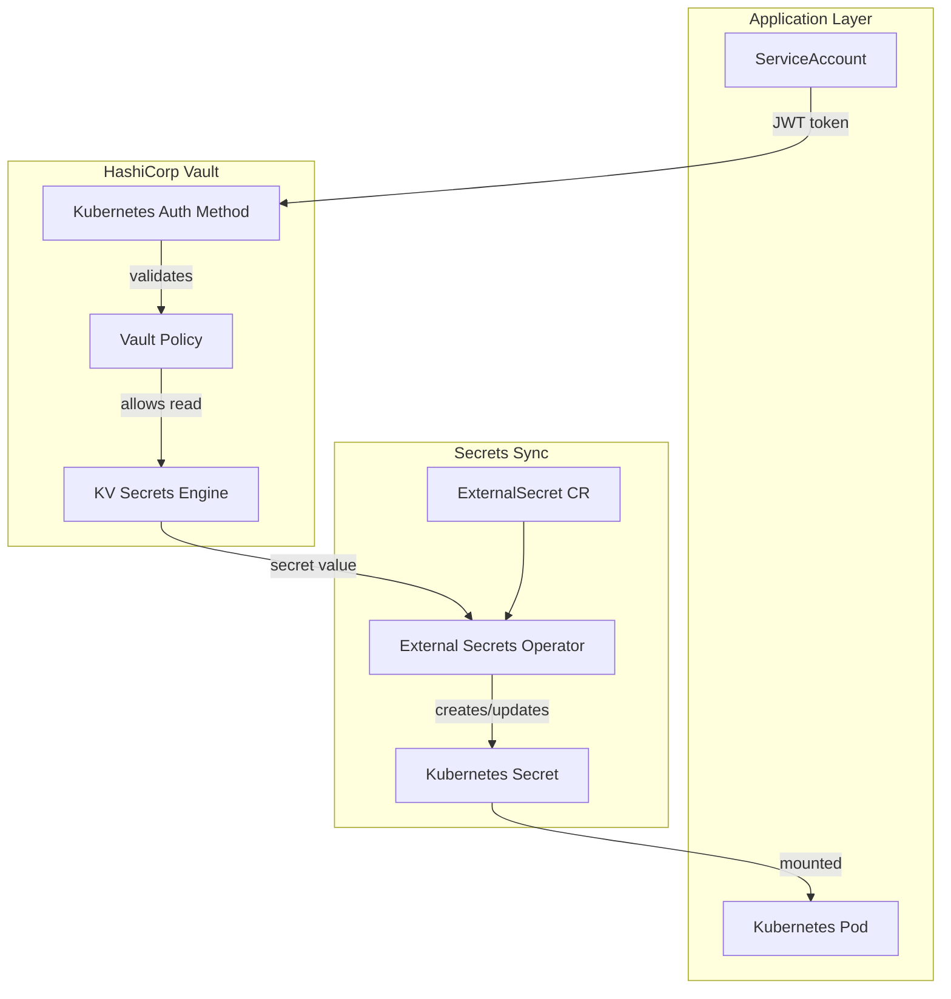

# Vault Standards

Standards for HashiCorp Vault integration, secrets management, and rotation procedures.

---

## Architecture Overview



---

## Secret Path Conventions

Vault secret paths follow a consistent hierarchy:

```
<mount>/<environment>/<team>/<application>/<secret-name>
```

**Examples:**

```
secret/tst/platform/grafana/admin-password
secret/prd/monitoring/prometheus/remote-write-token
secret/acc/security/vault-agent/approle-secret-id
```

### Mount Point Standards

| Mount | Purpose | Access |
|---|---|---|
| `secret/` | General KV secrets | Per-policy |
| `pki/` | Certificate authority | Restricted |
| `transit/` | Encryption as a service | Restricted |
| `database/` | Dynamic database credentials | Restricted |

---

## Vault Policies

Policies follow least-privilege. Grant only the paths and capabilities required.

```hcl
# Policy: grafana-read-tst
# Purpose: Allow Grafana to read its own secrets in tst environment

path "secret/data/tst/monitoring/grafana/*" {
  capabilities = ["read"]
}

path "secret/metadata/tst/monitoring/grafana/*" {
  capabilities = ["list"]
}
```

### Policy Naming

```
<application>-<permission>-<environment>
```

Examples: `grafana-read-tst`, `prometheus-read-prd`, `vault-agent-write-acc`

### Capability Reference

| Capability | Use |
|---|---|
| `read` | Retrieve a secret value |
| `list` | List secret paths (not values) |
| `create` | Create new secrets |
| `update` | Modify existing secrets |
| `delete` | Remove secrets |
| `deny` | Explicitly deny access |

Apply only the minimum capabilities required. Avoid `sudo` in application policies.

---

## Kubernetes Auth Method

Applications authenticate to Vault using Kubernetes service account JWT tokens.

```hcl
# Vault Kubernetes auth role
resource "vault_kubernetes_auth_backend_role" "grafana" {
  backend                          = vault_auth_backend.kubernetes.path
  role_name                        = "grafana-tst"
  bound_service_account_names      = ["grafana-sa"]
  bound_service_account_namespaces = ["monitoring-tst"]
  token_ttl                        = 3600
  token_policies                   = ["grafana-read-tst"]
  audience                         = "vault"
}
```

---

## External Secrets Operator

The External Secrets Operator (ESO) is the standard mechanism for syncing Vault secrets into Kubernetes.
Never use Vault Agent injector in new deployments — ESO provides better separation of concerns.

### SecretStore

```yaml
apiVersion: external-secrets.io/v1beta1
kind: SecretStore
metadata:
  name: vault-backend
  namespace: monitoring-tst
spec:
  provider:
    vault:
      server: "https://vault.example.com"
      path: "secret"
      version: "v2"
      auth:
        kubernetes:
          mountPath: "kubernetes"
          role: "grafana-tst"
          serviceAccountRef:
            name: grafana-sa
```

### ExternalSecret

```yaml
apiVersion: external-secrets.io/v1beta1
kind: ExternalSecret
metadata:
  name: grafana-credentials
  namespace: monitoring-tst
spec:
  refreshInterval: "1h"
  secretStoreRef:
    name: vault-backend
    kind: SecretStore
  target:
    name: monitoring-tst-grafana-credentials
    creationPolicy: Owner
  data:
    - secretKey: admin-password
      remoteRef:
        key: tst/monitoring/grafana/credentials
        property: admin-password
    - secretKey: secret-key
      remoteRef:
        key: tst/monitoring/grafana/credentials
        property: secret-key
```

---

## Secret Rotation

### Token Rotation Procedure

1. Generate new token/credential in the upstream system.
2. Write new value to Vault using `vault kv put`.
3. ExternalSecret will sync within `refreshInterval` or trigger manually.
4. Verify the application is using the new credential.
5. Revoke the old credential.
6. Update `CHANGELOG.md` with the rotation event.

### Rotation Frequency

| Secret Type | Recommended Rotation |
|---|---|
| Application API tokens | Every 90 days |
| Service account credentials | Every 180 days |
| Database passwords | Every 90 days |
| TLS certificates | 30 days before expiry |
| CI/CD pipeline secrets | Every 90 days |

### Expiry Enforcement

All Vault tokens must have a TTL configured:

```hcl
token_ttl     = 3600      # 1 hour for application tokens
token_max_ttl = 86400     # 24 hours maximum
token_period  = 0         # No periodic tokens unless required
```

---

## Security Rules

1. **Never use root tokens** in application code or CI/CD pipelines.
2. **Never store secrets** in environment variables in Vault policies or configurations.
3. **Always set TTL** on all dynamic credentials and tokens.
4. **Rotate immediately** if a credential is suspected of being compromised.
5. **Audit regularly** — review Vault audit logs for unexpected access patterns.
6. **Enable Vault audit logging** in all environments.
7. **Namespace secrets** — use Vault namespaces or mount prefixes to separate environments.

---

## Anti-patterns

| Anti-pattern | Why | Correct Approach |
|---|---|---|
| `kubectl create secret` in production | Bypasses secrets management | Use ExternalSecret + Vault |
| Hardcoded Vault paths in application code | Ties code to deployment topology | Use environment variables for path configuration |
| Single policy for all environments | Over-permissive | Separate policy per environment |
| `capabilities = ["*"]` | Grants all capabilities | Enumerate minimum required |
| No TTL on tokens | Leaked tokens are valid forever | Always set `token_ttl` |

---

## Production Considerations

- Run Vault in HA mode (3 or 5 nodes) with Raft integrated storage.
- Enable auto-unseal using cloud KMS (AWS KMS, GCP KMS, Azure Key Vault).
- Store Vault unseal keys in HSM or cloud secret manager — never on disk unencrypted.
- Enable Vault audit logging to a centralised log aggregation system.
- Monitor Vault using Prometheus metrics via the `/v1/sys/metrics` endpoint.
- Set up Vault DR replication for production environments.
